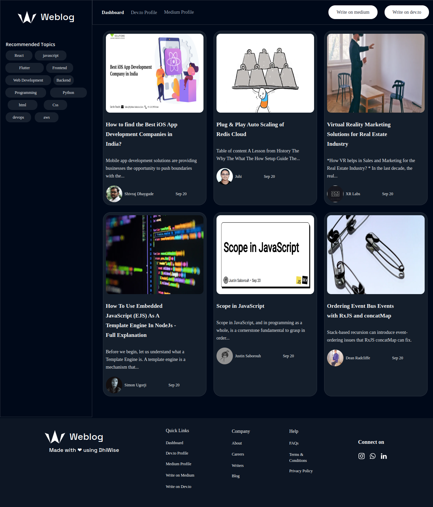
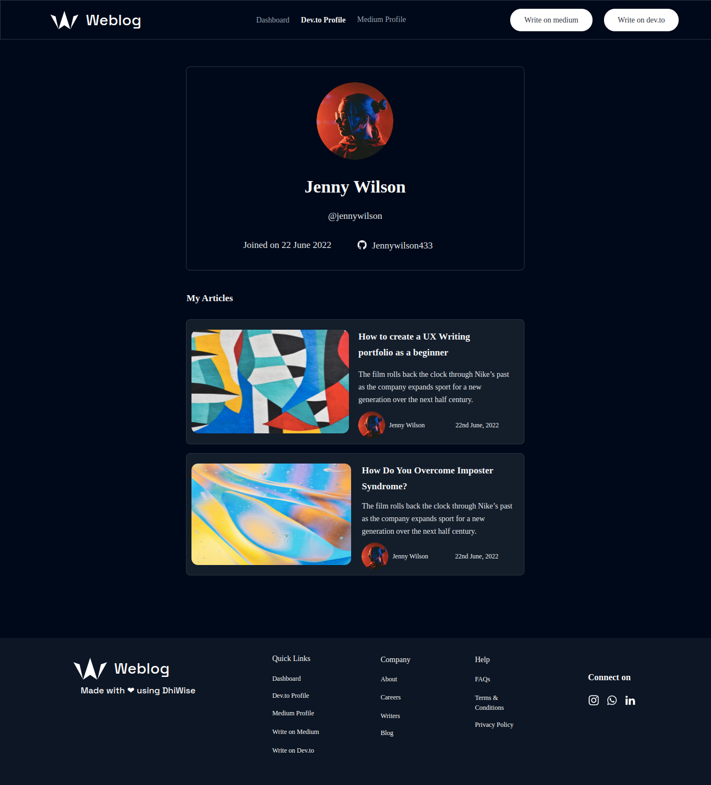
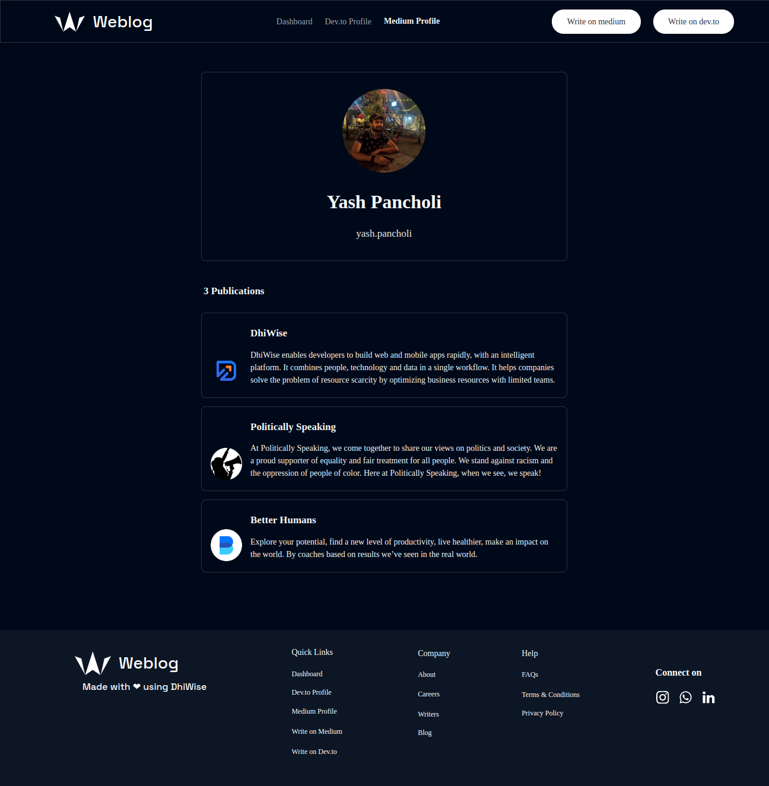
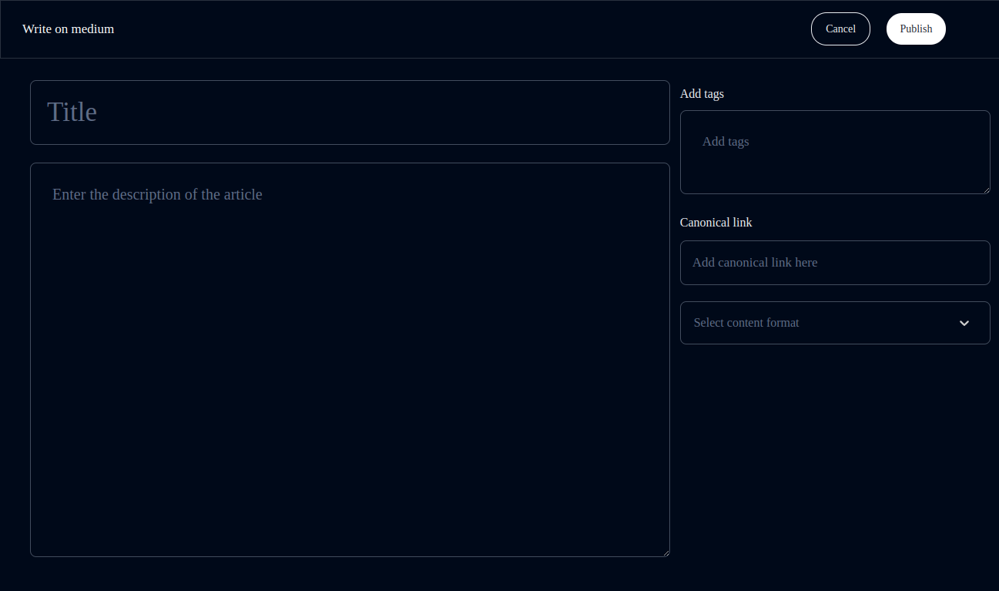

# Weblog

The Weblog is a blogging platform that allows users to manage both their Dev.to and Medium profiles.
Using this platform users can explore the new blogs from different categories. They can see the account details of the Dev.to and Medium. Also, users can post blogs on both platforms in one go.

This platform is made using [DhiWise](https://www.dhiwise.com/) and the open APIs of [Dev.to](https://developers.forem.com/api/#operation/getUserArticles), and [Medium](https://github.com/Medium/medium-api-docs#readme).

## Table of Contents

- [Features in Weblog](#features-provided-in-weblog)
- [Setup](#setup)
- [Version of Technologies](#version-of-technologies)
- [Folder Structure](#folder-structure)
- [Dependencies in project](#dependencies-in-the-project)
- [License](#license)
- [Community](#community)

## Features provided in Weblog

In Weblog, users can explore different blogs from the Dashboard. There is also a recommended topics list on the Dashboard. Using this list users can find blogs on a particular topic.



Users can check out his Dev.to profile and the blogs he has posted from the Dev profile page. Moreover, for the Medium profile users can check out his profile and the publications he has followed from the Medium profile page.




Users can post the blog on their Dev.to and Medium profile from the write on dev.to and write on medium pages. The user just needs to enter the details of his blog and click on publish button will publish his blog on the respective platform.



# Setup

Setup your project by running the following commands.

```sh
npm install
```

To run the application in the project directory, you can run:

```sh
npm start
```

Runs the app in the development mode.<br>
Open [http://localhost:3000](http://localhost:3000) to view it in the browser.

The page will reload if you make edits.<br>
You will also see any lint errors in the console.

## Clone Project

To clone a project firstly choose the directory to clone the project. Then open the terminal at the location and run the below commands.

    git clone https://github.com/DhiWise/Weblog.git

## Tokens required to run the project

In order to run this project, user needs Dev.to and Medium api key.

## Dev.to

For Dev.to Api key firstly go to Dev.to then go to settings, goto [extensions](https://dev.to/settings/extensions) scroll down to Generate a new Key.
Enter your application name and click on the Generate a new Key.

Copy the key and paste that key into the api.js file. Enter this key at the location of "Enter_your_Dev_to_API_Key_here".
For Api.js file Goto src folder -> goto service folder -> Api.js

```
.
├── src
│   ├── services
│   │   └── api.js ------ All API functions
```

## Medium

For Medium Token go to Medium then click on the profile icon on the left bottom side of the screen. Now go to [setting](https://medium.com/me/settings) select integration token.

Into Integration, tokens enter the description for your application and click on the integration token button copy that key and
paste that key into the api.js file. Enter this key at the location of "Enter_your_Medium_integration_token_here".
For Api.js file Goto src folder -> goto service folder -> Api.js

```
.
├── src
│   ├── services
│   │   └── api.js ------ All API functions
```

## Running the storybook

We have detected common components and have generated possible variants of it. To check the documentation of generated common components by integrating storybook, Please follow below steps.

## Install and Initializes

     npx storybook init

## Run the Storybook

      npm run storybook

## Version of Technologies

- [git](https://git-scm.com/) - v2.13 or greater
- [NodeJS](https://nodejs.org/en/) - `12 || 14 `
- [npm](https://www.npmjs.com/) - v6 or greater

# Folder Structure

After creation, your project should look like this:

```
.
├── package.json
├── package-lock.json
├── postcss.config.js
├── public
│   ├── favicon.ico
│   ├── index.html
│   ├── logo192.png
│   ├── logo512.png
│   ├── manifest.json
│   └── robots.txt
├── README.md
├── src
│   ├── App.js
│   ├── assets
│   │   ├── fonts ---------- Project fonts
│   │   └── images --------- All Project Images
│   ├── components --------- UI and Detected Common Components
│   ├── constants ---------- Project constants, eg: string consts
│   ├── hooks -------------- Helpful Hooks
│   ├── index.js
│   ├── pages -------------- All route pages
│   ├── Routes.js ---------- Routing
│   ├── styles
│   │   ├── index.css ------ Other Global Styles
│   │   └── tailwind.css --- Default Tailwind modules
│   └── util
│       └── index.js ------- Helpful utils
└── tailwind.config.js ----- Entire theme config, colors, fonts etc.
```

For the project to build, **these files must exist with exact filenames**:

- `public/index.html` is the page template;
- `src/index.js` is the JavaScript entry point.

# Dependencies in the project

Below are all the dependencies that were used in the project.

1. @tailwindcss/forms - `0.4.0`
2. @testing-library/jest-dom - `^5.15.1`
3. @testing-library/react - `^11.2.7`
4. @testing-library/user-event - `^12.8.3`
5. react - `17.0.2`
6. react-datepicker - `^4.5.0`
7. react-dom - `17.0.2`
8. react-router-dom - `6.0.2`
9. react-router-hash-link - `^2.4.3`
10. react-scripts - `5.0.0`
11. web-vitals - `^2.1.0`
12. axios - `^0.27.2`
13. lodash - `^4.17.21`
14. yup - `^0.32.11`
15. react-toastify - `^9.0.1`
16. prop-types - `^15.8.1`
17. react-select - `^5.2.1`

## License

MIT License

Copyright (c) 2022 DhiWise

Permission is hereby granted, free of charge, to any person obtaining a copy
of this software and associated documentation files (the "Software"), to deal
in the Software without restriction, including without limitation the rights
to use, copy, modify, merge, publish, distribute, sublicense, and/or sell
copies of the Software, and to permit persons to whom the Software is
furnished to do so, subject to the following conditions:

The above copyright notice and this permission notice shall be included in all
copies or substantial portions of the Software.

THE SOFTWARE IS PROVIDED "AS IS", WITHOUT WARRANTY OF ANY KIND, EXPRESS OR
IMPLIED, INCLUDING BUT NOT LIMITED TO THE WARRANTIES OF MERCHANTABILITY,
FITNESS FOR A PARTICULAR PURPOSE AND NON-INFRINGEMENT. IN NO EVENT SHALL THE
AUTHORS OR COPYRIGHT HOLDERS BE LIABLE FOR ANY CLAIM, DAMAGES OR OTHER
LIABILITY, WHETHER IN AN ACTION OF CONTRACT, TORT OR OTHERWISE, ARISING FROM,
OUT OF OR IN CONNECTION WITH THE SOFTWARE OR THE USE OR OTHER DEALINGS IN THE
SOFTWARE.

## Community

<a href="https://twitter.com/dhiwise"></a>
<a href="https://www.youtube.com/c/DhiWise"></a>
<a href="https://discord.com/invite/rFMnCG5MZ7"></a>
<a href="https://docs.dhiwise.com/"></a>
